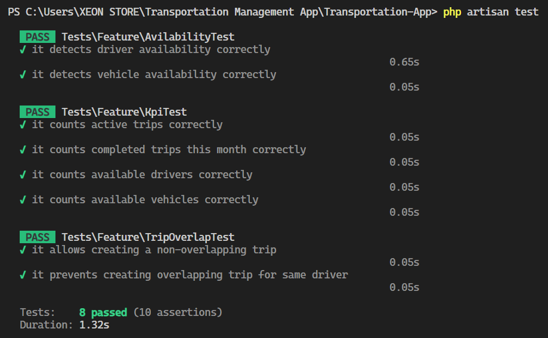

# Transportation Management App

A Laravel + Filament application for managing transportation operations (drivers, vehicles, trips).  
This project was built as part of a technical challenge and includes optimized business logic, overlapping trip validation, and a Pest test suite with high coverage.

---

## 🚀 Setup Instructions

### Requirements
- PHP 8.2+
- Composer
- MySQL
- Node.js & npm (for frontend assets)

### Installation
```bash
git clone https://github.com/usfsam7/Transportation-Management-App.git
cd Transportation-App

# Install backend dependencies
composer install

# Copy environment file
cp .env.example .env
php artisan key:generate

# Set up database in .env
DB_DATABASE=transportation
DB_USERNAME=root
DB_PASSWORD=

# Run migrations and seeders
php artisan migrate --seed

# Install frontend dependencies
npm install && npm run build

# Run the development server
php artisan serve
```
### 🎨 UI & UX Changes

- Dashboard KPIs in Topbar

Added KPIs (Active Trips, Active Vehicles, Active Drivers) in the top navigation bar for better visibility.

Implemented caching only for the completed trips widget in the dashboard (to prevent heavy recalculations without affecting real-time values elsewhere).

- Trip Management

Validation to prevent overlapping trips for the same driver or vehicle.

Improved trip status updates with an Artisan command (php artisan app:update-completed-trips) scheduled every minute.

- Driver & Vehicle Availability

Added clear availability indicators based on active/scheduled trips.

Optimized query logic so availability checks use exists() instead of fetching large datasets.


### 🛠 Key Design Decisions
1. Overlapping Trip Validation

 - Implemented validation logic in the Trip model to ensure:

   1- A driver cannot have two trips that overlap.

   2- A vehicle cannot be double-booked.

This was tested thoroughly with Pest to prevent edge cases.

2. Query Optimization

Availability checks use efficient exists() queries instead of loading full trip collections.

Artisan scheduler updates trips in the background to keep real-time data accurate.

3. UX Considerations

- Show only active drivers and vehicles in the time range selector when booking a new trip preventing trip overlap and enhancing user experience.

### 📌 Assumptions

 - Each trip belongs to one driver and one vehicle only.

- A trip has a start time and end time that must not overlap for the same driver/vehicle.

- Drivers and vehicles belong to a Company (multi-company support is included).

- Availability means no scheduled trip overlaps within the queried period.

### ✅ Testing

  - I used Pest for testing.
  - The following business logic is covered (≥80% coverage):
    1. Trip Overlap Validation
       - Prevents overlapping trips for drivers and vehicles.

    2. Availability Logic
       - Confirms drivers/vehicles are free or busy between given times.

    3. KPIs
      - Counts for active trips, completed trips this month, available drivers.

    

